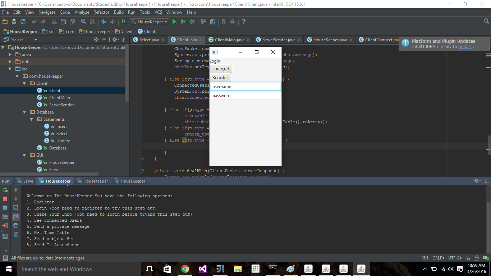
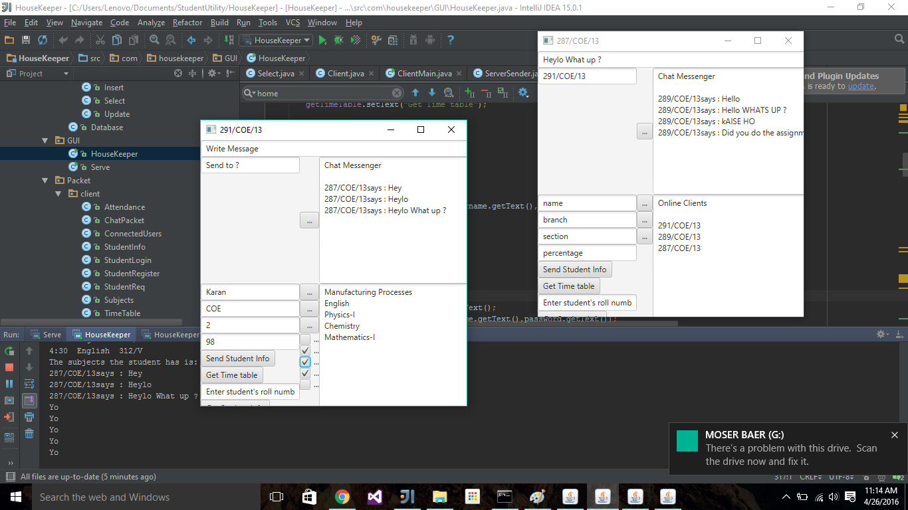
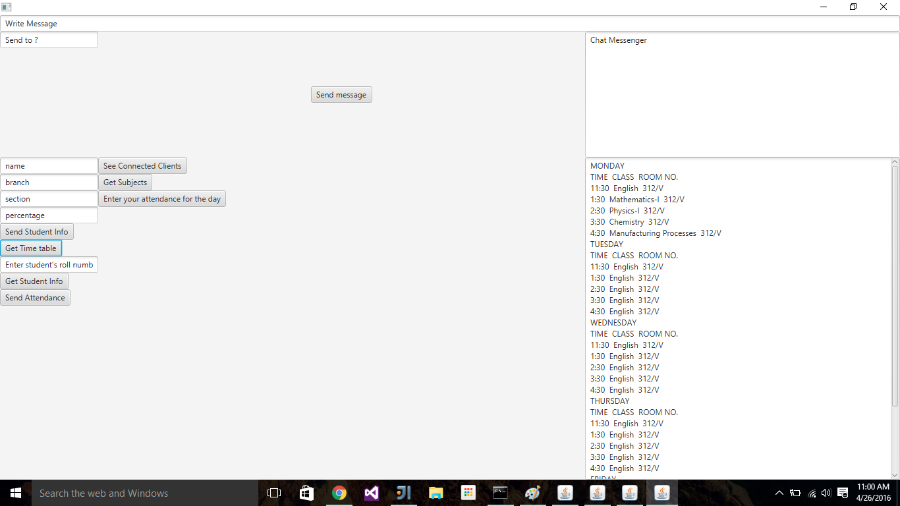
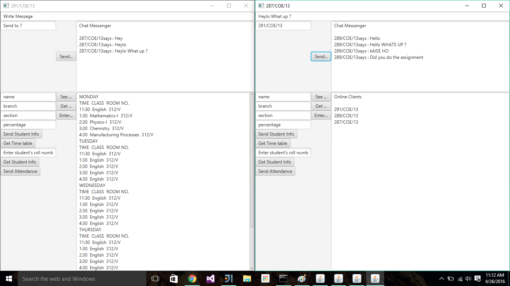

# HouseKeeper
A java application made to handle the boring parts of college.
* Your attendance.
* Current Aggregate Score.
* Time Tables.
* and So much more....

### Current Features
* [x] **A multithreaded server-client system**
* [x] **A packet system that allows for parsing of different types Of files(Timetables, Text, StudentInfo etc.)**  
* [x] **A Database Management System**
  - Student Info
  - Time Tables
  - Attendance
  - Percentage
* [x] **A Private Chat System**
  - Connected clients can private message each other.
  - Check what users are connected
* [ ] **GUI**
  - Making in JavaFX

# Overview

 The codebase is roughly divided into two parts.
 - The Server
 - The Client

## Server
The server is an entity that allows multiple clients to connect to it and exchange meaningful information.
All database operations occur through the server.
The server performs the following functions:
- Authentication of Client
- Reading/Writing into The Database with regard to client's information
- Provides a platform for communication between different clients

The server is multithreaded in nature ,which means that multiple clients can connect to it and each client is given its separate "instance" of the server.
In layman's terms it means that a prospective client does not have to wait for the preceding client to finish its work. Both the client's preform their operations in a parallel fashion.

Here is a comprehensive list of the functions in the Server directory and their use:
### Server Class
### Variables
1. **Port**:
The port on which server is instantiated.
2. **Clients**:
A list of Connected Client Socket connections.
3. **connectedUsers**:
 A subset of the connected clients ,containing just the roll numbers of the clients.
4. **server**:
A Java Server Socket variable which is the main server variable.
5. **clientSocket**:
The socket of the client that connects.
6. **runningThread**:
 The thread that runs listens for incoming connections.
7. **threadPool**:
This consists of an array of threads that are ready and primed for incoming connections. Whenever a client clients, a worker thread from this thread pool array is given to the socket connection for it's further communication. Right now the default value is 10 threads. Could be extended to the 1000's. A benefit of a thread pool is that whenever a thread is finished with its work it returns to this array. This ensures that more threads than the prescribed limit are not used which could potentially crash the P.C.

#### 1. Server Constructor
Instantiates the server object. Starts the serverSocket on prescribed *port* and instantiates the JDBC connection to **mySQL**.

Gives this socket connection to the main listening thread called "Server" and Starts the thread.

#### 2. run()
This function is automatically run when a thread is started. So whenever server Socket is started , this function runs.
It runs an infinite while loop which continue-sly listens in for client connection requests in the form as the **waitForConnection()** function.

#### 3. waitForConnection()

This function listens for incoming conn. on getting a new connection it accepts it, and instantiates the clientConnect object. Which handles all further client communication.
This clientConnect object which contains the clientSocket is given to a worker thread plucked from the thread pool.

#### 4. findClientConnection(Roll Number)

A helper function used to find out the clientConnect object of a specific roll number.
Useful for private Messaging.

#### 5. addtoConnectedClientList(ClientConnect object)

Adds client to the connectedUsers List. Again, useful for messaging and broadcast facility.

### ClientConnect Class
#### Purpose
The purpose of this class is to handle a one to one server/client connection.

#### Variables
1. clientSocket *(Socket)*
2. serverText *(String)*
3. input *(ObjectInput Stream)* - handles input stream, from client to server.
4. output *(ObjectOutput Stream)* - handles output stream, from server to client.
5. StudentInfo - a class object which stores student information like class, roll number, year etc.
6. server *(Server Object)*
The server object which spawned this current calss object into its seperate thread.
7. roll_number *(roll_number)*
8. running -*(boolean)*- checks if server is running or client is still connected.
9. insert,select,update (*MySQL operation helper classes*)
10. auth_code *(String)*- This is interesting as to maintain security, an Authentication mechanism which prevents any information sharing from the server side if the client does not have this auth code in its request header. This code is generated on logging in. It is a random 32-byte alphanumeric string.

### FUNCTIONS

#### Constructor
a.k.a the run() method which runs on spawning the thread with this client connect class object as one of its parameters.
It sets up the input and output Streams through the **setupStreams()** function. Instantiates the insert , select, update helper objects which directly interact with the database.

And then an infinite loop
is run on the condition that *running* is true.
There is just one function in this loop. The ** connection() ** .

All of this is encapsulated in a try and a catch block for any SQL/IO Exceptions.

#### setupStreams()
 Setups the I/O streams. For awesome communication brah !
#### connection()

The bread and butter of this entire server setup :D.
It's aim is to listen for incoming requests from the client, checks if these requests are authenticated, parse the requests according to the request type and respond accordingly.

The *auth()* function checks for validity of request and also reponds back. This code section needs to be cleaned up but the functionality is all there.

If auth fails. A message is sent to the client telling it so, through the *sendtoClient()* function.

Also to maintain good coding style All this is encased in a try and a catch block.

If any exception occurs a message is sent to client informing it of the client to maintain transparency.

#### auth()

This function is basically a big if else mess. What it currently does is it identifies what **type** the request is of. Examples include
* LOGIN
* REGISTER
* STUDENTINFO
* TIMETABLE
* CONNECTED_USERS
* CHAT REQUEST
* SUBJECTS
* ATTENDANCE

Apart from the login and register requests, the auth code is verified.

Each request is of a Packet class type as the base class. Further classes are made by extending this Packet class.
A more detailed look at the Packet class of Objects will undertaken soon.

Depending on the type of the request the packet is cast to the actual class type. For example the input stream is parsed and the object is type casted to Packet. Now on further checking the type of Packet, for example ,if it is a STUDENT_LOGIN request this packet is further type casted into StudentLogin class which extends Packet.

A brief overview of all request types:
* Register: Check if user with a same roll number does  not already exist. If not then makes a new record into the user table putting roll number and password and returns a message to the client depending in the outcome.

* Login: Performs the table check if password and roll number match as in the database. It return an alphanumeric 32 bit string auth code to the client and also stores it in the class variable *auth_code*.

* StudentInfo: The student sends in information like section ,year, branch, age etc. , to the server in the form of a *StudentInfo* object.
The logic checks if auth code matches, if yes then it updates the user details in the MYSQL database.

* Connected Users:
 Sends in the roll number of the  currently connected clients to the server.

* Chat: Receives a message and a destination roll number. Checks if that roll number is connected , if yes then it sends the message object to the destination user through accessing **its** clientConnect object's *sendToClient()* function

* Subjects: Sends a list of sentences to the client after parsing the timetable
* Attendance: Gets a list of numbers in the form of how many classes the student has attended *that* day eg(1 - for one class,2 - for two classes and so on)
On receiving these numbers it updates the database table attendance accordingly.

#### sendToClient()

This function takes as parameters a Packet class object, which is then deserialized into bytes and sent through the output stream of the server to the client.

#### stop()

This function closes the connection between client and server from the server side. After closing the *clientSocket* and calls the *removeFromClient()* function.

#### removeFromClient()
This function removes the closing client from the clients array in the server class. So as to remove the client from the currently connected users list.

## Conclusion

With this we come to an end on the overview of The server setup of this application.

The client side architecture and the packet class system will be explained in the coming days.

## to be continued . . .

## Screenshots (Beta)

#### Contributors
<!-- Contributors START
Karan_Chahal karanchahal https://github.com/karanchahal code doc
Mayank_Badola mbad0la https://github.com/mbad0la doc
Contributors END -->
<!-- Contributors table START -->
| [ Karan Chahal](https://github.com/karanchahal) [💻](https://github.com/o-d-i-n/HouseKeeper/commits?author=karanchahal) [📖](https://github.com/o-d-i-n/HouseKeeper/commits?author=karanchahal) | [ Mayank Badola](https://github.com/mbad0la) [📖](https://github.com/o-d-i-n/HouseKeeper/commits?author=mbad0la) |
| :---: | :---: |
<!-- Contributors table END -->
